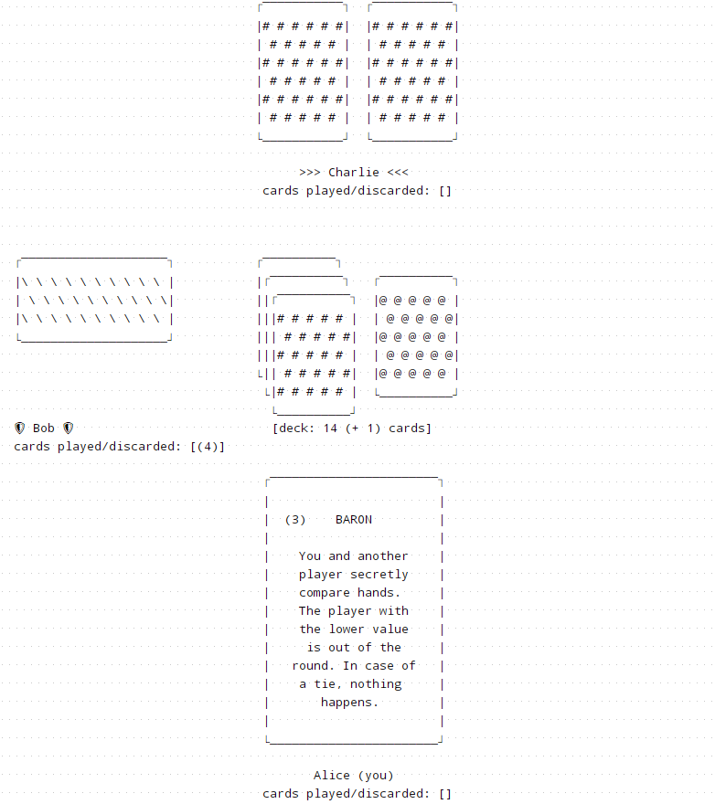

# LoveLetter


A Python replica of the board game [Love Letter by Z-MAN Games](https://www.zmangames.com/en/games/love-letter/).

This project exposes the following top-level Python packages:

- **`loveletter`** – 
  The core package with all the game logic and nothing else.
- **`loveletter_multiplayer`** –
  A sample multiplayer engine based on a client/server model for playing games over a
  network using TCP sockets.
  It uses `asyncio` and `async`/`await` as its "concurrency framework", so to speak.
  Depends on `loveletter`.
- **`loveletter_cli`** –
  A command line user interface for single- or multiplayer games.

  

The reason these are split into several top-level packages instead of having all be part
of a single `loveletter` package is to make it more modular and easier to replace any 
of the components:
for example, one could implement a different user interface for local-only games, and
they would only need the core `loveletter` package; 
or one could implement a different multiplayer engine;
etc.


## Love Letter CLI - Instructions

Go to the [Releases tab](https://github.com/plammens/loveletter/releases) and select a version, usually the [latest](https://github.com/plammens/loveletter/releases/latest).
Download the artifact corresponding to your operating system (`loveletter-<version>-<OS>.*`) and follow the instructions below.

### Windows

Download the executable `loveletter-<version>-Windows.exe` (you might have to ignore warnings about unknown executable etc.).
Double click on the executable to run it.
You might have to ignore the Windows SmartScreen warning about an unknown publisher ("More info" > "Run anyway").


### macOS

Download the tarball `loveletter-<version>-macOS.tar`.
Double click on the tarball, this will automatically extract the executable `loveletter-<version>-macOS`.
Double click on the executable to run it.
In case of a security warning about an unknown developer, you might have to right click on the executable and select "Open" and then proceed at the warning.


### Linux

Download the tarball `loveletter-<version>-Linux.tar`.
Extract the executable `loveletter-<version>-Linux` from the tarball, for instance by running `tar -xvf loveletter-<version>-Linux.tar`.
Open a terminal in the same directory and run the executable:
```bash
./loveletter-<version>-Linux
```
